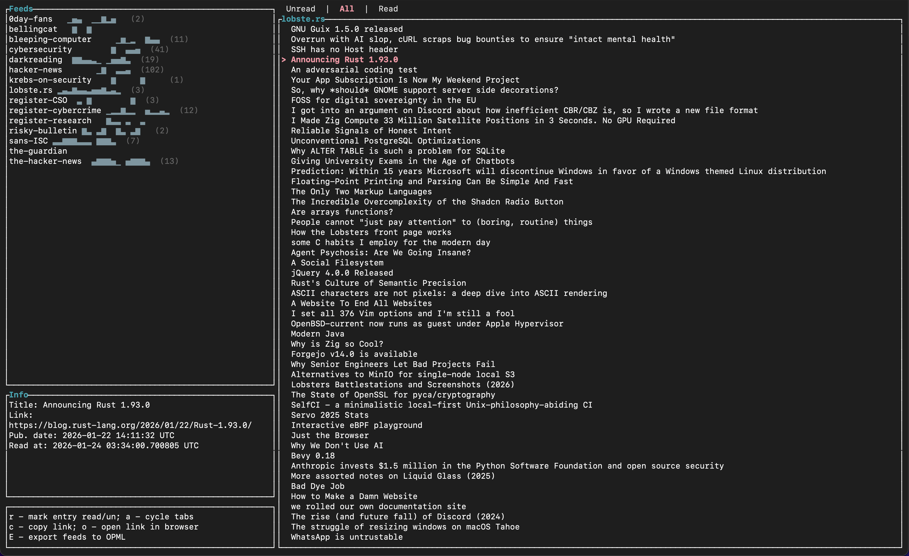

# rss-tui

rss-tui [*rust-ooey*] is based on russ, which is a TUI RSS/Atom reader with vim-like controls, written in [Rust](https://rust-lang.org/).

This is a new repo from a fork of [ckampfe/russ](https://github.com/ckampfe/russ), with a few improvements.

[](https://crates.io/crates/rss-tui)
[](https://github.com/shalloran/rss-tui/actions/workflows/ci.yml)

---


*rss-tui in all its text-based glory*

## install

### From crates.io (recommended):

```console
cargo install rss-tui
```
Note that on linux, you may need additional system dependencies as well, for example:
```console
sudo apt update && sudo apt install libxcb-shape0-dev libxcb-xfixes0-dev
```
The binary will be installed as `rss-tui`. You can run it with:
```console
rss-tui read
```
**Note:** At this time, only macOS and Linux are tested. If you are using this on Windows, reach out!

### From this repository:

```console
cargo install rss-tui --git https://github.com/shalloran/rss-tui
```

**Note:** This is a fork with some additional features. If you want the original, use: `cargo install russ --git https://github.com/ckampfe/russ`.

**Note:** If you want to force overwrite an existing installation, use:
`cargo install --force rss-tui` (from crates.io) or `cargo install --force --git https://github.com/shalloran/rss-tui rss-tui` (from git)

**Note** that on its first run with no arguments, `rss-tui read` creates a SQLite database file called `feeds.db` to store RSS/Atom feeds in a location of its choosing. If you wish to override this, you can pass a path with the `-d` option, like `rss-tui -d /your/database/location/my_feeds.db`. If you use a custom database location, you will need to pass the `-d` option every time you invoke `rss-tui`. See the help with `rss-tui -h` for more information about where `rss-tui` will store the `feeds.db` database by default on your platform.

## use

rss-tui is modal, like vim. If you read the following controls section and tinker a bit, you'll have no trouble using rss-tui.

There are two modes: normal mode and insert mode.

### controls - normal mode

Some normal mode controls vary based on whether you are currently selecting a feed or an entry:

- `q`/`Esc` - quit rss-tui
- `hjkl`/arrows - move up/down/left/right between feeds and entries, scroll up/down on an entry
- `Enter` - read selected entry
- `r` - refresh the selected feed (when feeds selected) or mark entry as read/unread (when entries selected)
- `x` - refresh all feeds
- `i`/`e` - change to insert mode (when feeds selected)
- `e` - email the current article (when viewing an entry; opens your default email client with the article title as subject and URL as body)
- `a` - toggle between read/unread entries
- `c` - copy the selected link to the clipboard (feed or entry)
- `o` - open the selected link in your browser (feed or entry)
- `d` - delete the selected feed (with confirmation; press `d` again to confirm, `n` to cancel)
- `E` - export all feeds to an OPML file (saves to a timestamped file in your database directory)
- `ctrl-u`/`ctrl-d` - scroll up/down a page at a time

### controls - insert mode

- `Esc` - go back to normal mode
- `Enter` - subscribe to the feed you just typed in the input box
- `Del` - delete the selected feed

## help/options/config

```console
rss-tui -h
A TUI RSS reader with vim-like controls and a local-first, offline-first focus

Usage: rss-tui <COMMAND>

Commands:
  read    Read your feeds
  import  Import feeds from an OPML document
  export  Export feeds to an OPML document
  help    Print this message or the help of the given subcommand(s)

Options:
  -h, --help     Print help
  -V, --version  Print version
```

## read mode

```console
rss-tui read -h
Read your feeds

Usage: rss-tui read [OPTIONS]

Options:
  -d, --database-path <DATABASE_PATH>
          Override where `rss-tui` stores and reads feeds. By default, the feeds database on Linux this will be at `XDG_DATA_HOME/rss-tui/feeds.db` or `$HOME/.local/share/rss-tui/feeds.db`. On MacOS it will be at `$HOME/Library/Application Support/rss-tui/feeds.db`. On Windows it will be at `{FOLDERID_LocalAppData}/rss-tui/data/feeds.db`
  -t, --tick-rate <TICK_RATE>
          time in ms between two ticks [default: 250]
  -f, --flash-display-duration-seconds <FLASH_DISPLAY_DURATION_SECONDS>
          number of seconds to show the flash message before clearing it [default: 4]
  -n, --network-timeout <NETWORK_TIMEOUT>
          RSS/Atom network request timeout in seconds [default: 5]
  -h, --help
          Print help
```

## import OPML mode

```console
rss-tui import -h
Import feeds from an OPML document

Usage: rss-tui import [OPTIONS] --opml-path <OPML_PATH>

Options:
  -d, --database-path <DATABASE_PATH>
          Override where `rss-tui` stores and reads feeds. By default, the feeds database on Linux this will be at `XDG_DATA_HOME/rss-tui/feeds.db` or `$HOME/.local/share/rss-tui/feeds.db`. On MacOS it will be at `$HOME/Library/Application Support/rss-tui/feeds.db`. On Windows it will be at `{FOLDERID_LocalAppData}/rss-tui/data/feeds.db`
  -o, --opml-path <OPML_PATH>

  -n, --network-timeout <NETWORK_TIMEOUT>
          RSS/Atom network request timeout in seconds [default: 5]
  -h, --help
          Print help
```

## export OPML mode

```console
rss-tui export -h
Export feeds to an OPML document

Usage: rss-tui export [OPTIONS] --opml-path <OPML_PATH>

Options:
  -d, --database-path <DATABASE_PATH>
          Override where `rss-tui` stores and reads feeds. By default, the feeds database on Linux this will be at `XDG_DATA_HOME/rss-tui/feeds.db` or `$HOME/.local/share/rss-tui/feeds.db`. On MacOS it will be at `$HOME/Library/Application Support/rss-tui/feeds.db`. On Windows it will be at `{FOLDERID_LocalAppData}/rss-tui/data/feeds.db`
  -o, --opml-path <OPML_PATH>
          Path where the OPML file will be written
  -h, --help
          Print help
```

You can also export from within the TUI by pressing `E` (capital E) in normal mode. This will create a timestamped OPML file in the same directory as your database.

## design

rss-tui is a [tui](https://crates.io/crates/tui) app that uses [crossterm](https://crates.io/crates/crossterm). rss-tui stores all application data in a SQLite database. 

## features/todo

This is not a roadmap, just a list of potential features.

### my feature list

- [x] visual indicator for which feeds have new/unacknowledged entries (partially complete)
- [x] bug: text wrapping has been sorted
- [ ] sync / online mode?
- [ ] integration with ollama or LMStudio for local summarization

## Minimum Supported Rust Version (MSRV) policy

rss-tui targets the latest stable version of the Rust compiler. Older Rust version may work, but we are not supporting them.

## SQLite version

`rss-tui` compiles and bundles its own embedded SQLite via the [Rusqlite](https://github.com/rusqlite/rusqlite) project, which is version 3.45.1.

If you prefer to use the version of SQLite on your system, edit `Cargo.toml` to
remove the `"bundled"` feature from the `rusqlite` dependency and recompile `rss-tui`.

## contributing

The original project welcomes contributions. If you have an idea for something you would like to contribute to the original, open an issue on [ckampfe/russ](https://github.com/ckampfe/russ) and they can address it!

For this fork, I'm happy to consider pull requests, but keep in mind this is primarily for my own use. If you want a feature that's more broadly useful, consider contributing to the upstream project instead.

## license

See the [license.](LICENSE)
SPDX-License-Identifier: AGPL-3.0-or-later